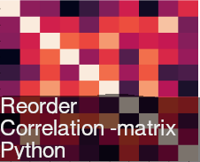

# ReCorPy

> A python's package for reordering/clustering correlation matrices


[![PyPI Version][pypi-image]][pypi-url]
[![Build Status][build-image]][build-url]
[![Code Coverage][coverage-image]][coverage-url]
[![Code Quality][quality-image]][quality-url]
<a href="https://github.com/psf/black"></a>

`recorpy` reorder correlation matrixes to get better visual analysis. All it is made with the original dataframe. And the result
is a new dataframe with columns reordered, to let you re-use it wherever you want.

Input parameters:

-   _method_ - 
-   _model_ - , default: 
-   _cluster_ - , default: 


## Installation

```sh
pip install recorpy
```

## Usage


```python
        >>> df = pd.DataFrame(np.random.rand(3,3))
        >>> ReorderCorr(df)
```

## Development setup

```sh
$ python3 -m venv env
$ . env/bin/activate
$ make deps
$ tox
```

## Contributing

Pull requests are welcome. For major changes, please open an issue first to discuss what you would like to change.

Make sure to add or update tests as appropriate.

Use [Black](https://black.readthedocs.io/en/stable/) for code formatting and [Conventional Commits](https://www.conventionalcommits.org/en/v1.0.0-beta.4/) for commit messages.

## [Changelog](CHANGELOG.md)

## License

[GPL](https://choosealicense.com/licenses/gpl/)

<!-- Badges -->

[pypi-image]: https://img.shields.io/pypi/v/recorpy
[pypi-url]: https://pypi.org/project/recorpy/
[build-image]: https://github.com/thebooort/recorpy/actions/workflows/build.yml/badge.svg
[build-url]: https://github.com/thebooort/recorpy/actions/workflows/build.yml
[coverage-image]: https://codecov.io/gh/thebooort/recorpy/branch/main/graph/badge.svg
[coverage-url]: https://codecov.io/gh/thebooort/recorpy
[quality-image]: https://api.codeclimate.com/v1/badges/3130fa0ba3b7993fbf0a/maintainability
[quality-url]: https://codeclimate.com/github/thebooort/recorpy

