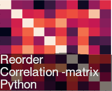

.. ReCorPy documentation master file, created by
   sphinx-quickstart on Mon Jun 27 17:57:26 2022.
   You can adapt this file completely to your liking, but it should at least
   contain the root `toctree` directive.

Welcome to ReCorPy's documentation!
===================================

A python's package for reordering/clustering correlation matrices.

`recorpy` reorder correlation matrixes to get better visual analysis. All it is made with the original dataframe. And the result
is a new dataframe with columns reordered, to let you re-use it wherever you want.

.. toctree::
   :maxdepth: 3
   :caption: Readme
   
   README
   	
.. toctree::
   :maxdepth: 2
   :caption: Modules
   
   modules

.. toctree::
   :maxdepth: 3
   :caption: Contact information
   
   Contact
   

Indices and tables
==================

* :ref:`genindex`
* :ref:`modindex`
* :ref:`search`
